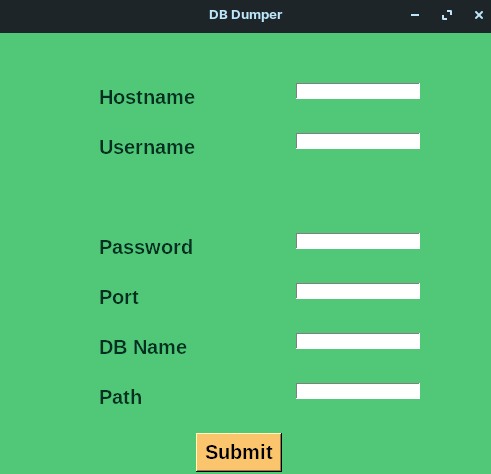

# db_dumper 🚚

This application built in the python with using tkinter libary and the using with the command line option just like mysql command.


## Badges


[](https://github.com/kunaldesign/Christmas-Mood-2021/issues)
[](https://github.com/kunaldesign/Christmas-Mood-2021)
[](/CONTRIBUTING.md)
[](https://github.com/kunaldesign/Christmas-Mood-2021)
[](/LICENSE)
[](https://twitter.com/kunalhedaoo25)

[](/CONTRIBUTING.md)


[](/LICENSE)


## Tech Stack

**dependencies:** python3-tk,python3,mysql-server,mysql-client

**application**: ✔️

**installable:** ✔️

**auto_install:** ❎
## Screenshots




## Installation

Install my-project with npm

```bash
  npm install my-project
  cd my-project
```
    
## Authors

- [@kunaldesign](https://github.com/kunaldesign) 👨‍💼


## License

[MIT](https://choosealicense.com/licenses/mit/)


## Support

For support, email kunalhedaoo25@gmail.com 


## Features

- Easy UI
- Separate Directory for dump
- Fullscreen mode
- Easy dump


## Contributing

Contributions are always welcome!

See `contributing.md` for ways to get started.

Please adhere to this project's `code of conduct`.

